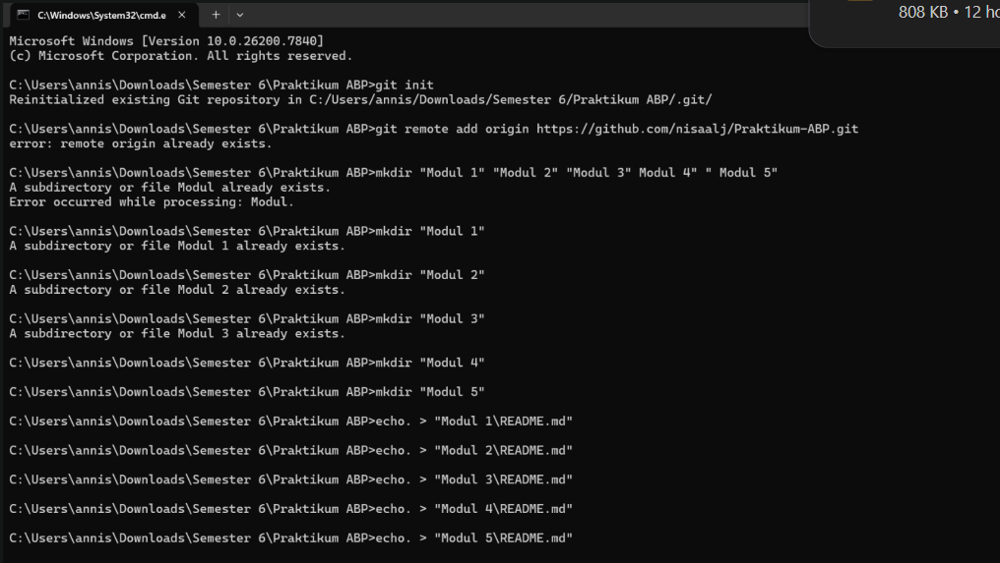
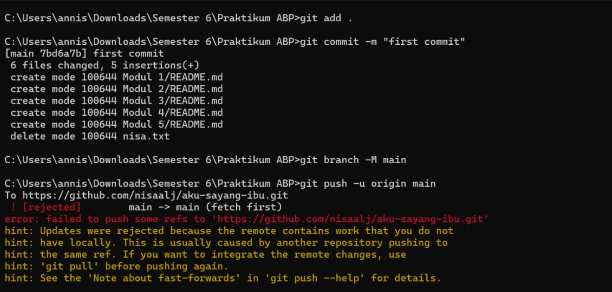

# Modul 1 - Setup Repository via CLI

# Deskripsi
Pada modul ini dilakukan setup repository GitHub menggunakan Command Line Interface (CLI) melalui Command Prompt (CMD) di Windows.
- Git
- Command Prompt (CMD)
- GitHub

# Langkah-langkah

# 1. Inisialisasi Repository Lokal
Pertama buka CMD dan masuk ke folder project, lalu jalankan perintah git init untuk menginisialisasi repository git di lokal.

# 2. Menghubungkan ke Repository GitHub
Hubungkan repository lokal ke repository yang sudah dibuat di GitHub menggunakan perintah git remote add origin https://github.com/nisaalj/Praktikum-ABP.git

# 3. Membuat Folder Modul 1 sampai 5
Buat folder untuk setiap modul langsung melalui CMD menggunakan perintah mkdir "Modul 1" "Modul 2" "Modul 3" "Modul 4" "Modul 5"

# 4. Upload ke GitHub
Lakukan commit dan push semua file ke GitHub menggunakan perintah git add, git commit, git branch, dan git push.

# Hasil
Repository berhasil dibuat dan terhubung ke GitHub beserta struktur folder Modul 1 sampai Modul 5.

