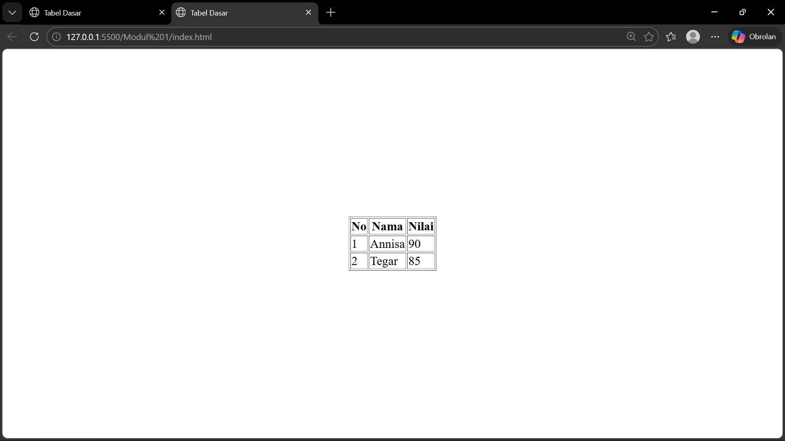

# Modul 2 - Tabel Dasar

## Deskripsi
Membuat tampilan tabel dasar yang berada di tengah layar tanpa menggunakan CSS atau styling apapun.

## Cara Kerja
Menggunakan teknik nested table (tabel di dalam tabel) dengan atribut align="center" dan valign="middle" untuk memposisikan tabel di tengah layar.

## Kode Program

### index.html
<html>
<head>
    <title>Tabel Dasar</title>
</head>
<body>

<table width="100%" height="100%">
    <tr>
        <td align="center" valign="middle">

            <table border="1">
                <tr>
                    <th>No</th>
                    <th>Nama</th>
                    <th>Nilai</th>
                </tr>
                <tr>
                    <td>1</td>
                    <td>Annisa</td>
                    <td>90</td>
                </tr>
                <tr>
                    <td>2</td>
                    <td>Tegar</td>
                    <td>85</td>
                </tr>
            </table>

        </td>
    </tr>
</table>

</body>
</html>

## Hasil
