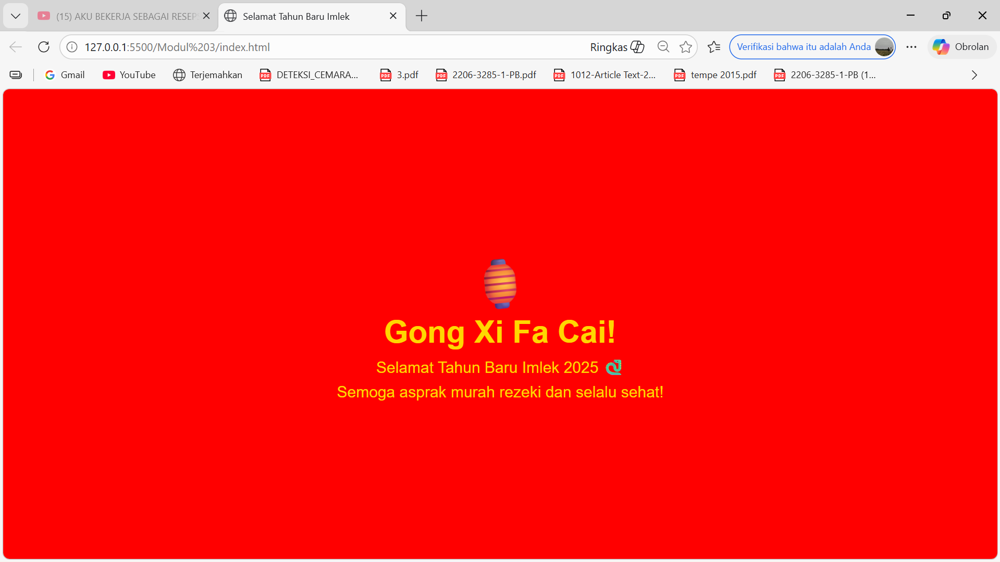

# Modul 3 - Halaman Perayaan Imlek

# Kode Program

# index.html

    Selamat Tahun Baru Imlek
    
        body {
            background-color: red;
            display: flex;
            justify-content: center;
            align-items: center;
            height: 100vh;
            margin: 0;
            font-family: Arial, sans-serif;
        }

        .container {
            text-align: center;
            color: gold;
        }

        .judul {
            font-size: 50px;
            font-weight: bold;
        }

        .subjudul {
            font-size: 25px;
            margin-top: 10px;
        }

        .lampion {
            font-size: 80px;
            animation: goyang 1s infinite alternate;
        }

        @keyframes goyang {
            from { transform: rotate(-10deg); }
            to { transform: rotate(10deg); }
        }
    

    
        🏮
        Gong Xi Fa Cai!
        Selamat Tahun Baru Imlek 2025 🐍
        Semoga asprak murah rezeki dan selalu sehat!

# Deskripsi
Membuat halaman web untuk merayakan Tahun Baru Imlek hanya menggunakan CSS murni tanpa library apapun dan tanpa JavaScript.
- HTML
- CSS (tanpa library, tanpa JavaScript)

# Fitur
- Background merah khas imlek
- Teks berwarna emas
- Animasi lampion bergoyang menggunakan CSS Animation (@keyframes)
- Tampilan terpusat di tengah layar menggunakan CSS Flexbox

# Cara Kerja
Halaman ini menggunakan CSS untuk mengatur tampilan dan animasi. Animasi lampion dibuat menggunakan `@keyframes` yang merupakan fitur CSS murni tanpa bantuan JavaScript. Warna merah dan emas dipilih karena merupakan warna khas perayaan Imlek.

# Hasil
