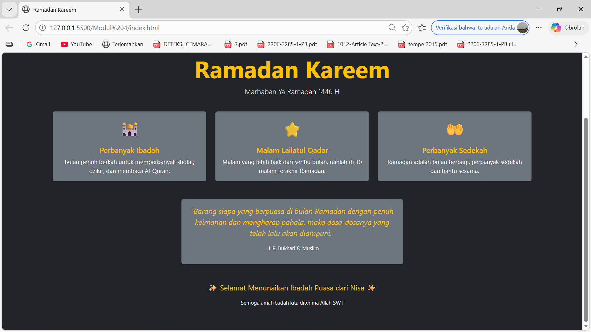

 # Modul 4 - Halaman Ramadan dengan Bootstrap

## Deskripsi
Membuat halaman web untuk merayakan bulan Ramadan menggunakan Bootstrap 5 semaksimal mungkin dan meminimalkan penggunaan native CSS.
- HTML
- Bootstrap 5
- Sedikit Native CSS (cuma buat ukuran emoji dan max-width card)

## Penjelasan Penggunaan Bootstrap
Hampir seluruh styling pada halaman ini menggunakan class Bootstrap, diantaranya:

- bg-dark dan text-white untuk warna background dan teks
- min-vh-100, d-flex, align-items-center, justify-content-center untuk layout tengah layar
- display-3, fw-bold, text-warning, lead untuk styling teks dan judul
- container, row, col-md-4, g-4 untuk sistem grid dan layout kartu
- card, card-body, card-title, card-text untuk komponen kartu
- bg-secondary untuk warna kartu
- fst-italic, fs-1, fs-5, small untuk ukuran dan style teks
- mt-5, mb-4, py-5, p-4 untuk jarak antar elemen

## Native CSS yang Digunakan
Sesuai tugas yaitu sebisa mungkin tanpa menggunakan native CSS, native CSS yang digunakan hanya sebatas dua hal yaitu font-size pada emoji karena Bootstrap tidak menyediakan ukuran emoji sebesar itu, dan max-width pada card quote agar tampilannya tidak terlalu lebar di layar besar.

## Hasil

